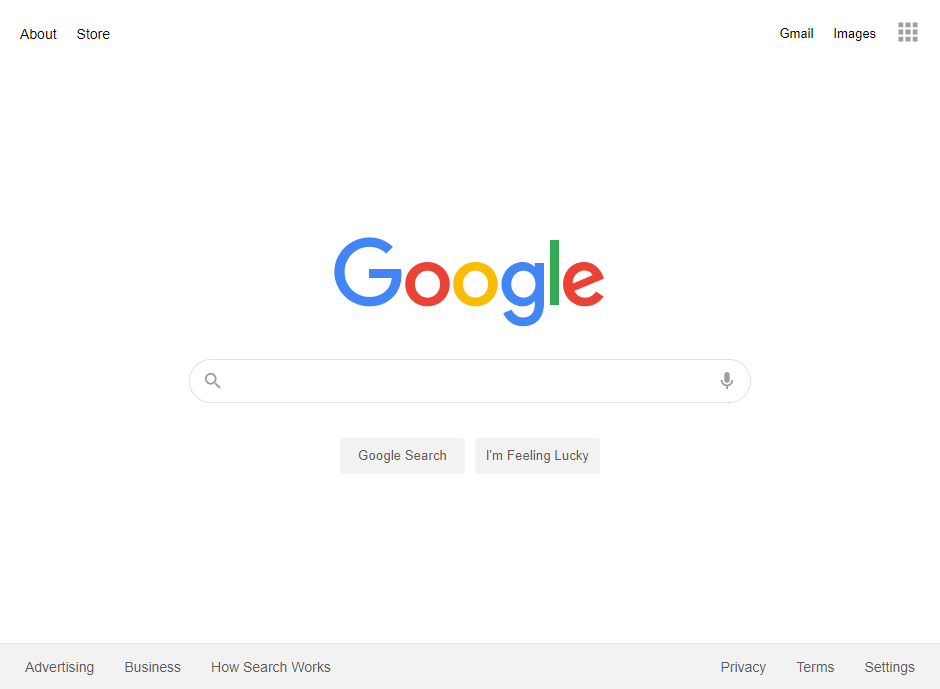

# Google Mock Front Page

## Overview
A rebuild of Google's iconic front page for getting familiar with the front-end languages, demonstrating basic proficiency with HTML and CSS.

It aims to be as aesthetically similar as possible to the Google front page, with basic functionality such as element scaling, and interactive buttons and search forms in place.

This project was completed as part of [The Odin Project](https://github.com/TheOdinProject/curriculum)
curriculum.

## Usage
The page is hosted on GitHub Pages and can
be accessed [here](https://willkip.github.io/google-mock-front-page/).

Below is its appearance in a scaled-down window:

## Summary and Outcomes
This project was my first major foray into HTML and CSS. I was able to learn
how to structure a full webpage and style it with a combination of the two
dependent languages, and publish an aesthetically web-ready page.
- I used **HTML semantic elements** for better accessibility and project structure.
- I used **CSS Flexbox** for positioning of elements.
- I used **CSS pseudo-classes** such as **:hover** and **:active-within** to replicate
element behaviour as in the real front page.
- I used **CSS variables** for maintainability and consistency during development.
### Improvement
The project structure could have been cleaner, with more usage of comments and logical,
consistent placement of elements and property orders.

There is also room for improvement in the site design, as it does not perfectly 
replicate the margin scaling behaviour, or the bottom nav bar's 'snapping' of its
children based on width.

## Acknowledgements
Eric Meyer's [CSS Reset](https://meyerweb.com/eric/tools/css/reset/) was used to standardize
the viewing experience cross-browser.

The page design and logo is based on [Google's Front Page](https://www.google.com/), as of 
May 2021.

The open-source icons used are from [Google Fonts](https://fonts.google.com/icons).

## License
This project is licensed under [MIT](https://choosealicense.com/licenses/mit/).
